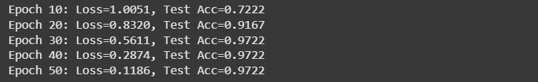

# HARCNet: Hybrid Attention Residual Capsule Network

## Overview

HARCNet is a custom neural network architecture designed for tabular datasets, such as those available in scikit-learn. It combines capsule representations, self-attention, residual learning, and learnable feature weighting into a single unified structure. The goal is to move beyond traditional multilayer perceptrons and enable dynamic feature interactions and improved interpretability.

---

## Architectural Design

### 1. Feature Weighting Module

Each input feature has an associated learnable weight that scales its contribution before entering the network.

* Acts as an adaptive attention mask for tabular features.
* Allows the model to emphasize or suppress features during training.

### 2. Dense Capsule Block

The weighted input is transformed into a small set of vector-based “capsules.”

* Each capsule encodes a group of features as a vector rather than independent scalars.
* Captures richer feature relationships and preserves orientation information in the representation space.

### 3. Self-Attention Gate

Capsule outputs interact through a self-attention mechanism.

* Enables the model to learn dependencies between different feature groups.
* Enhances contextual awareness among capsules, similar to transformer attention.

### 4. Residual Dense Layers

The attention output is processed by dense layers with residual connections.

* Stabilizes training and mitigates vanishing gradients.
* Facilitates feature reuse and gradient flow.

### 5. Output Layer

A final linear projection produces class logits or regression outputs.

---

## Information Flow

**Input → Feature Weighting → Dense Capsule Transformation → Self-Attention → Residual Dense Layers → Output**

This structure integrates adaptive feature importance, vectorized reasoning, and cross-feature communication within a compact feedforward framework.

Accuracy on Wine Dataset

---

## Distinctive Properties

| Component         | Role                                  | Novel Aspect                               |
| ----------------- | ------------------------------------- | ------------------------------------------ |
| Feature Weighting | Learns per-feature scaling            | Implicit attention on tabular inputs       |
| Capsule Block     | Vector representation of features     | Introduces capsule logic to non-image data |
| Self-Attention    | Models relationships between capsules | Dynamic feature interaction                |
| Residual Pathway  | Adds stability and depth              | Preserves gradients across layers          |

---

## Intended Use

HARCNet is optimized for structured datasets with a moderate number of features and samples. It provides a foundation for experiments involving interpretability, adaptive learning, and capsule-attention hybrids in tabular domains.
